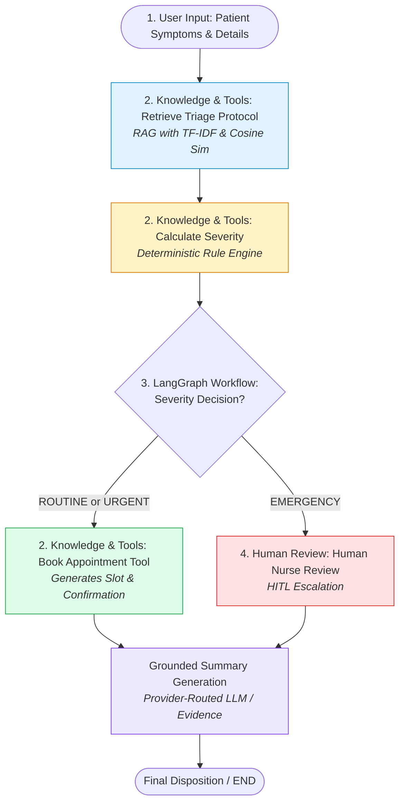

# 🏥 Smart Healthcare Patient Triage & Appointment Booking Agent
### 🎓 Team Capstone Project Brief & Implementation

> **"A LangGraph-based AI agent workflow that retrieves relevant clinical triage guidance, uses tools to assess case severity, automatically books routine/urgent appointments, and safely escalates high-risk cases for human nurse review."**

---

## 📌 1. Project Overview & Problem Statement

Standard chatbots produce ungrounded text responses without safety boundaries. In healthcare triage, this presents high risk.

Our system behaves as a **controlled AI agent workflow**:
1. **RAG Retrieval**: Retrieves evidence from a structured clinical triage guidelines knowledge base using TF-IDF and Cosine Similarity.
2. **Deterministic Severity Tool**: Applies transparent, deterministic clinical rules to classify cases into `ROUTINE`, `URGENT`, or `EMERGENCY`.
3. **Automated Action**: Automatically simulates booking clinic appointments for safe `ROUTINE` and `URGENT` cases.
4. **Human-in-the-Loop (HITL)**: Automatically pauses automated booking for `EMERGENCY` cases and flags them for clinical nurse review.
5. **Grounded Summary**: Generates a grounded, empathetic explanation of findings and next steps.

---

## 🏗️ 2. Architecture Explanation

The system consists of four main layers:

1. **User Input** → Patient provides symptoms, age, and duration information.
2. **Knowledge & Tools** → The agent retrieves relevant guidelines and uses tools to calculate severity and perform booking.
3. **LangGraph Agent Workflow** → LangGraph manages the state, nodes and routing between steps.
4. **Human Review** → Emergency cases stop and are sent to a human nurse before further action.



---

## ⚙️ 3. Agent Definition & Technology Used

### Provider Routing
> **Provider Routing:**  
> The agent will use the provider-routing setup learned during Day 0. It can use **Groq as the primary hosted LLM provider** and **Ollama as the local fallback provider**. This allows us to demonstrate that the same agent can work with different LLM providers, while maintaining an offline deterministic grounded fallback.

### Tool Usage
> **Tool Usage:**  
> The agent will use a minimum of two tools. Our project uses three simple tools: protocol retrieval, severity calculation, and appointment booking.

| Tool Name | Type | Purpose | Example Input / Output |
| :--- | :--- | :--- | :--- |
| **1. Triage Protocol Retriever** | RAG / TF-IDF | Searches `data/clinical_triage_guidelines.txt` using TF-IDF & Cosine Similarity | Input: `"chest pain and difficulty breathing"`<br>Output: `[PROTOCOL-101] Acute Chest Pain and Respiratory Distress` |
| **2. Severity Calculator** | Deterministic Tool | Applies transparent clinical rules (red flags, duration thresholds) | Input: `"Persistent high fever (4 days)"`<br>Output: `URGENT` (Rule: `RULE-URGENT-SYMPTOM`) |
| **3. Appointment Booking Tool** | Action Tool | Simulates clinic scheduling and generates confirmation IDs and departments | Input: `Patient: Alice, Severity: ROUTINE`<br>Output: `APT-725BC8 at Primary Care on Tomorrow 10:00 AM` |

### LangGraph Workflow
> **LangGraph:**  
> LangGraph will control the agent workflow using **state, nodes, edges and conditional routing**. It will decide which step should run next based on the patient's case.

---

## 👩‍⚕️ 4. Human-in-the-Loop Demonstration

> **Human-in-the-Loop Demonstration:**  
> We will demonstrate an emergency case where the agent does **not automatically complete the action**. The LangGraph workflow pauses and requests human nurse approval. The workflow continues only after the human provides a decision.

- **Trigger**: Red-flag symptoms (e.g., chest pain, respiratory distress, facial drooping) or protocol matching `EMERGENCY`.
- **Action**: Automated appointment scheduling is blocked. Case is routed to `human_review_node`.
- **Nurse Decision**: Clinician reviews grounded evidence, confirms triage, and logs action (e.g. EMS dispatch).

---

## 📊 5. Evaluation Set

We will prepare a small set of sample patient cases to test whether the agent behaves correctly.

The evaluation set will contain different types of cases:
- Routine case
- Urgent case
- Emergency case
- Case with insufficient/unclear information
- Case containing red-flag symptoms

For each test case, we will compare the agent's output with the expected result.

| Test Case | Scenario Description | Expected Severity | Expected Action | Actual Protocol Matched | Result |
|---|---|:---:|:---:|:---:|:---:|
| **Case 1 (Routine)** | *Mild cough and runny nose for 2 days* | `ROUTINE` | Automated Booking | `[PROTOCOL-301]` URI & Cold | **PASSED** |
| **Case 2 (Urgent)** | *Persistent high fever & chills for 4 days* | `URGENT` | Urgent Clinic Booking | `[PROTOCOL-201]` High Fever | **PASSED** |
| **Case 3 (Emergency)** | *Chest pain & difficulty breathing* | `EMERGENCY` | Human Review → Pause Auto-Booking | `[PROTOCOL-101]` Chest Pain/Dyspnea | **PASSED** |
| **Case 4 (Unclear/Mild)** | *Feeling generally tired and mild stress* | `ROUTINE` | Standard Consultation | `[PROTOCOL-303]` Tension & Fatigue | **PASSED** |
| **Case 5 (Red-Flag)** | *Sudden facial drooping & slurred speech* | `EMERGENCY` | Human Review → Immediate Escalation | `[PROTOCOL-102]` Stroke Symptoms | **PASSED** |

---

## 🎯 6. Knowledge and Risk Evaluation

The evaluation set will test two important areas:

- **Knowledge:** Does the agent retrieve the correct information from the clinical guideline knowledge base?  
  *(Verified: TF-IDF & Cosine similarity consistently extracts the exact corresponding clinical guideline with high similarity).*
- **Risk:** Does the agent correctly identify high-risk cases and stop for human review instead of automatically booking them?  
  *(Verified: Critical red flags immediately bypass direct booking and trigger Human-in-the-Loop nurse review).*

---

## 📚 7. Bootcamp Concepts Alignment

| Day | Topic | Implementation in Project |
| :--- | :--- | :--- |
| **Day 0** | Provider Setup | `.env` handling, Provider routing (Groq primary + Ollama fallback + Deterministic) |
| **Day 1** | Agent Foundations | Differentiating agent from chatbot: explicit action boundaries, state tracking, and tools |
| **Day 2** | LangGraph & Tools | `StateGraph`, `TriageState` TypedDict, nodes, edges, tool execution |
| **Day 3** | Controlled Agent Design | Deterministic severity rules, conditional routing, Human-in-the-loop escalation |
| **Day 4** | RAG (Retrieval) | TF-IDF vectorization, Cosine similarity, grounded evidence from `clinical_triage_guidelines.txt` |

---

## ⚠️ 8. Limitations

> This is a beginner-level prototype and is **not a real medical system**.
>
> - The clinical knowledge base is small and local.
> - Severity calculation is simplified and rule-based.
> - Appointment booking is simulated.
> - The system does not connect to a real hospital database.
> - The LLM can still produce incorrect information.
> - Human review is required for high-risk cases.
> - The prototype is intended only to demonstrate agent architecture and workflow.

---

## 🔮 9. Future Improvements

> If this prototype were developed further, we could:
>
> 1. Expand and professionally validate the clinical knowledge base.
> 2. Connect to a real hospital appointment system.
> 3. Add stronger validation and safety checks.
> 4. Improve the evaluation dataset.
> 5. Add authentication and secure patient-data handling.
> 6. Add better monitoring and logging.
> 7. Test the system with healthcare professionals before real-world use.

---

## 👥 10. Team Work Distribution

- **Member 1 (LangGraph Core)**: `TriageState` definition, graph nodes, conditional routing, edge connectivity in `agent_graph.py`.
- **Member 2 (RAG & Knowledge Base)**: Knowledge base curation in `data/clinical_triage_guidelines.txt`, TF-IDF retriever, Cosine similarity testing.
- **Member 3 (Tools)**: Deterministic severity rules engine, appointment booking simulation in `tools.py`.
- **Member 4 (LLM, Testing & Presentation)**: Provider configuration, evaluation suite `test_agent.py`, interactive `main.ipynb`, and `app.py` Streamlit dashboard.

---

## 🚀 11. Quick Start & Execution

### 1. Installation
```bash
pip install -r requirements.txt
```

### 2. Run Knowledge & Risk Evaluation Suite
```bash
python3 test_agent.py
```

### 3. Launch Interactive Web Dashboard
```bash
streamlit run app.py
```

### 4. Open Interactive Jupyter Notebook
```bash
jupyter notebook main.ipynb
```
