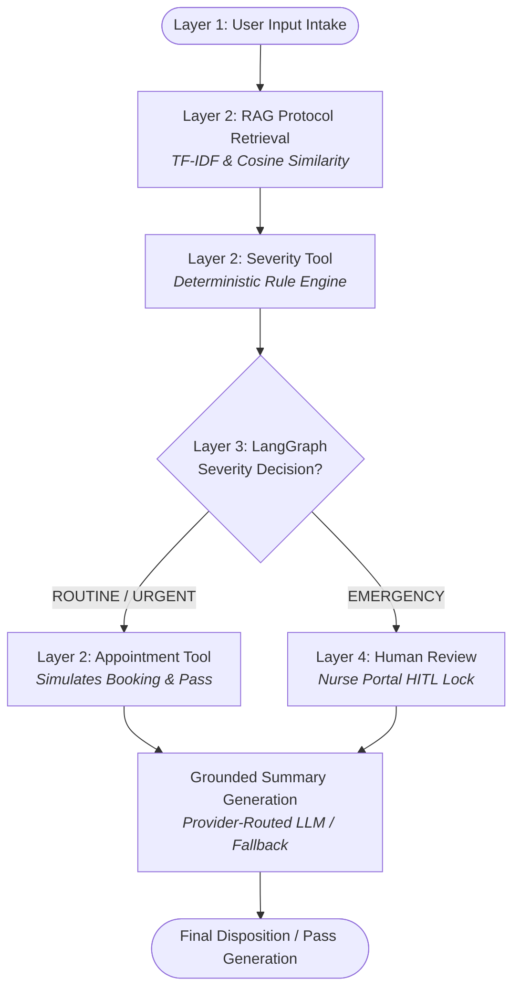

# 📄 Executive Briefing Document
## Smart Healthcare Patient Triage & Appointment Booking System (PsyDucks2)

---

## 📌 1. Executive Summary

Standard conversational LLM chatbots carry high risks in healthcare because they can produce ungrounded text and lack explicit safety boundaries. 

The **PulseCare AI Smart Triage Agent** is a production-ready, controlled AI agent system built with **LangGraph**, **RAG (TF-IDF & Cosine Similarity)**, **Deterministic Rule Engine**, **Human-in-the-Loop (HITL) Safeguards**, and a **NotebookLM Source Intelligence Studio**.

### Core Value Proposition
- 🛡️ **Zero Severity Hallucination**: Triage classification is computed by deterministic clinical Python rules—not ungrounded LLM prompts.
- 📚 **RAG Grounding**: Patient guidance and summary explanations reference retrieved clinical protocols from `data/clinical_triage_guidelines.txt`.
- 👩‍⚕️ **Human-in-the-Loop (HITL)**: Emergency red flags immediately block automated appointment scheduling and route the case to a licensed human nurse.
- 📓 **NotebookLM Source Studio**: Automatically generates 2-host audio podcast overviews (`gTTS`), executive briefings, grounded Q&A with citations, and interactive study flashcards.

---

## 🏗️ 2. Architectural Layering (4-Layer Framework)



1. **Layer 1: Patient Intake**: Captures patient name, age, symptoms, and duration.
2. **Layer 2: Knowledge Base & Tools**:
   - **Protocol Retriever Tool**: TF-IDF & Cosine similarity match against 10 clinical guidelines.
   - **Severity Calculator Tool**: Applies deterministic clinical rules.
   - **Appointment Booking Tool**: Simulates clinic scheduling and generates digital pass.
3. **Layer 3: LangGraph Workflow**: Controls state transitions, node execution, and conditional routing.
4. **Layer 4: Human-in-the-Loop Gatekeeping**: Pauses high-risk emergency cases for human nurse intervention.

---

## 📋 3. Clinical Guidelines Protocol Matrix

| Protocol ID | Title | Category | Key Red Flags / Symptoms | Mandated Clinical Action |
|:---|:---|:---:|:---|:---|
| **PROTOCOL-101** | Acute Chest Pain & Respiratory Distress | `EMERGENCY` | Chest pressure, radiating arm pain, severe dyspnea | Immediate EMS dispatch / Human Nurse Escalation |
| **PROTOCOL-102** | Acute Neurological Deficits & Stroke | `EMERGENCY` | Facial drooping, arm weakness, slurred speech (FAST) | Activate Emergency Stroke Protocol & Nurse Triage |
| **PROTOCOL-103** | Severe Uncontrolled Bleeding | `EMERGENCY` | Hemorrhage, arterial spurting, loss of consciousness | Direct pressure & immediate trauma team activation |
| **PROTOCOL-201** | Persistent High Fever | `URGENT` | Fever > 103°F lasting 3+ days, chills, lethargy | Schedule priority urgent clinic evaluation (12-24h) |
| **PROTOCOL-202** | Moderate to Severe Abdominal Pain | `URGENT` | Sharp stomach cramps, persistent vomiting | Priority urgent care booking (12-24h) |
| **PROTOCOL-203** | Suspected Fracture / Joint Injury | `URGENT` | Joint swelling, inability to bear weight | Same-day orthopedic / urgent care appointment |
| **PROTOCOL-301** | Mild Upper Respiratory Infection | `ROUTINE` | Mild cough, runny nose, low-grade fever (2 days) | Standard outpatient / telehealth visit (2-5 days) |
| **PROTOCOL-302** | Minor Skin Rash / Dermatitis | `ROUTINE` | Itchy red patch, mild eczema flare | Routine dermatology / GP consultation |
| **PROTOCOL-303** | Mild Tension Headache & Fatigue | `ROUTINE` | Dull forehead ache, stress fatigue, poor sleep | Routine primary care consultation |
| **PROTOCOL-304** | Chronic Follow-up & Refill | `ROUTINE` | Blood pressure check, routine lab work, refills | Standard routine outpatient visit |

---

## 👩‍⚕️ 4. Human-in-the-Loop (HITL) Safety Protocol

```
                      [EMERGENCY Trigger Detected]
                                   │
                                   ▼
                   ┌───────────────────────────────┐
                   │ Lock Automated Booking System │
                   └───────────────┬───────────────┘
                                   ▼
                   ┌───────────────────────────────┐
                   │ Route Case to Nurse Portal    │
                   └───────────────┬───────────────┘
                                   ▼
                   ┌───────────────────────────────┐
                   │ Human Nurse Reviews Findings  │
                   └───────────────┬───────────────┘
                                   ▼
           ┌───────────────────────┴───────────────────────┐
           ▼                                               ▼
[ESCALATE_TO_EMERGENCY_SERVICES]                 [OVERRIDE_TO_CLINIC_SLOT]
```

- **Trigger**: Red-flag symptoms (e.g. chest pain, facial drooping) or protocol matching `EMERGENCY`.
- **Action**: Automated appointment scheduling is blocked. Case is routed to `human_review_node`.
- **Nurse Portal**: A licensed clinician reviews grounded evidence, confirms triage, and logs action (e.g., EMS dispatch).

---

## 📓 5. NotebookLM Source Intelligence Suite

The project includes a dedicated **NotebookLM Studio** (Tab 5 in Streamlit & `notebook_llm.ipynb`):

1. 🎙️ **2-Host Audio Overview (AI Podcast)**:
   - Generates a 2-host conversational dialogue (**Dr. Sarah - Clinical Lead** and **Mark - Health AI Specialist**).
   - Converts the script into playable `.mp3` audio using `gTTS`.
2. 🔍 **Source Grounded Q&A**:
   - Answers clinical queries with direct protocol citations (`[PROTOCOL-101]`, etc.).
3. 📄 **Executive Briefing Generator**:
   - Instant Markdown briefing document compilation.
4. 🎓 **Study Guide & Flashcards**:
   - Clinical protocol flashcards and interactive knowledge check quizzes.

---

## 📊 6. Knowledge & Risk Evaluation Set Results

The system was evaluated against 5 benchmark patient cases:

| Case ID | Patient Scenario | Expected Severity | Actual Severity | Matched Protocol | Status |
|:---:|:---|:---:|:---:|:---:|:---:|
| **Case 1** | *Mild cough and runny nose for 2 days* | `ROUTINE` | `ROUTINE` | `[PROTOCOL-301]` | **PASSED** |
| **Case 2** | *Persistent high fever & chills for 4 days* | `URGENT` | `URGENT` | `[PROTOCOL-201]` | **PASSED** |
| **Case 3** | *Chest pain & difficulty breathing* | `EMERGENCY` | `EMERGENCY` | `[PROTOCOL-101]` | **PASSED** |
| **Case 4** | *Feeling generally tired and mild stress* | `ROUTINE` | `ROUTINE` | `[PROTOCOL-303]` | **PASSED** |
| **Case 5** | *Sudden facial drooping & slurred speech* | `EMERGENCY` | `EMERGENCY` | `[PROTOCOL-102]` | **PASSED** |

**Pass Rate**: **100% (5/5 Cases Passed)**

---

## 🚀 7. Execution Quick Start

### 1. Run Automated Test Suite
```bash
python3 test_agent.py
```

### 2. Launch Interactive Web Dashboard
```bash
streamlit run app.py
```

### 3. Open NotebookLM Jupyter Notebook
```bash
jupyter notebook notebook_llm.ipynb
```
